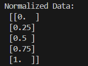

# P2 - Data Normalization with MinMaxScaler

## Description
This project demonstrates data normalization using scikit-learn's MinMaxScaler. Normalization is a crucial preprocessing step in machine learning that scales numerical data to a fixed range, typically [0,1].

## Algorithm

### MinMax Normalization Process
1. **Data Input**: Define sample data as a 2D array `[[20], [40], [60], [80], [100]]`
2. **Scaler Creation**: Create a MinMaxScaler object from scikit-learn
3. **Fit and Transform**: Apply `fit_transform()` to normalize data to range [0,1]
4. **Output**: Display the normalized values

### Mathematical Background
- **MinMax Scaling Formula**: `X_scaled = (X - X_min) / (X_max - X_min)`
  - Where `X` is the original value
  - `X_min` is the minimum value in the dataset
  - `X_max` is the maximum value in the dataset
  - Result is always between 0 and 1

### Code Flow
```
1. Import MinMaxScaler from sklearn.preprocessing
2. Define sample data as 2D array
3. Create MinMaxScaler instance
4. Apply fit_transform() method
5. Display normalized results
```

## Libraries Used
- **scikit-learn**: For the MinMaxScaler preprocessing tool
- **NumPy**: Implicitly used by scikit-learn for array operations

## Expected Output
For input data `[20, 40, 60, 80, 100]`:
```
Normalized Data:
[[0.0]    # 20 → 0.0 (minimum)
 [0.25]   # 40 → 0.25
 [0.5]    # 60 → 0.5 (middle)
 [0.75]   # 80 → 0.75
 [1.0]]   # 100 → 1.0 (maximum)
```

### Output Screenshot


## Why Normalization?
- **Scale Independence**: Ensures all features contribute equally to machine learning models
- **Faster Convergence**: Helps optimization algorithms converge faster
- **Prevents Bias**: Prevents features with larger scales from dominating others
- **Algorithm Requirements**: Some algorithms (like neural networks, SVM) require normalized input

## Use Cases
- Preprocessing for machine learning models
- Preparing data for neural networks
- Feature scaling for distance-based algorithms (KNN, K-means)
- Data standardization for comparative analysis

## Files
- `p2.py`: Main Python script for data normalization
- `i2.png`: Output visualization/result
- `README.md`: This documentation file

## How to Run
```bash
cd p2
python p2.py
```

## Learning Objectives
- Understanding data preprocessing techniques
- Working with scikit-learn preprocessing tools
- Importance of feature scaling in machine learning
- Mathematical concepts behind normalization
