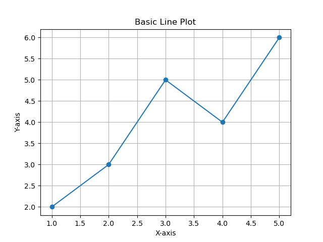

# P3 - Basic Data Visualization with Matplotlib

## Description
This project demonstrates basic data visualization using matplotlib, creating a simple line plot with markers. Data visualization is fundamental for exploratory data analysis and communicating insights from data.

## Algorithm

### Line Plot Creation Process
1. **Data Definition**: Create sample x and y coordinates
   - x-axis: `[1, 2, 3, 4, 5]`
   - y-axis: `[2, 3, 5, 4, 6]`
2. **Plot Creation**: Use `plt.plot()` with marker parameter for line plot with points
3. **Customization**: Add title, axis labels, and grid for better readability
4. **Display**: Show the completed plot

### Visualization Components
- **Line Plot**: Connects data points with lines to show trends
- **Markers**: Circular markers ('o') to highlight individual data points
- **Grid**: Background grid for easier value reading
- **Labels**: Descriptive text for axes and plot title

### Code Flow
```
1. Import matplotlib.pyplot
2. Define x and y data arrays
3. Create line plot with markers using plt.plot()
4. Add plot customizations:
   - Title: "Basic Line Plot"
   - X-axis label: "X-axis"
   - Y-axis label: "Y-axis"
   - Grid: True
5. Display plot with plt.show()
```

## Libraries Used
- **Matplotlib**: For creating static, animated, and interactive visualizations

## Plot Features
- **Line Connection**: Shows relationship between consecutive points
- **Circular Markers**: Visual emphasis on data points
- **Grid Lines**: Helps in reading precise values
- **Axis Labels**: Clear identification of what each axis represents
- **Title**: Descriptive heading for the plot

## Expected Output
A line plot showing:
- 5 data points connected by lines
- Circular markers at each point
- Grid background for reference
- Labeled axes and title
- Values ranging from 1-5 on x-axis and 2-6 on y-axis

### Output Screenshot


## Visualization Best Practices Demonstrated
- **Clear Labeling**: Both axes and plot have descriptive labels
- **Grid Usage**: Makes it easier to read values
- **Marker Usage**: Emphasizes individual data points
- **Appropriate Styling**: Simple, clean appearance

## Use Cases
- Exploratory data analysis
- Trend visualization
- Scientific data presentation
- Educational demonstrations
- Report generation

## Files
- `p3.py`: Main Python script for data visualization
- `i3.png`: Generated plot image
- `README.md`: This documentation file

## How to Run
```bash
cd p3
python p3.py
```

## Learning Objectives
- Understanding basic matplotlib functionality
- Creating line plots with markers
- Plot customization techniques
- Data visualization best practices
- Introduction to scientific plotting in Python
