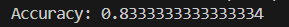

# P5 - Accuracy Score Calculation for Classification

## Description
This project demonstrates the calculation of accuracy score using scikit-learn's metrics module. Accuracy is one of the most fundamental and widely used metrics for evaluating classification model performance.

## Algorithm

### Accuracy Score Calculation Process
1. **Data Preparation**: Define actual and predicted class labels
   - `y_true = [1, 0, 1, 1, 0, 1]` (actual/ground truth labels)
   - `y_pred = [1, 0, 0, 1, 0, 1]` (model predictions)
2. **Accuracy Computation**: Use `accuracy_score()` function from scikit-learn
3. **Result Display**: Output the calculated accuracy value

### Mathematical Background
**Accuracy Formula**: 
```
Accuracy = (Number of Correct Predictions) / (Total Number of Predictions)
Accuracy = (TP + TN) / (TP + TN + FP + FN)
```

Where:
- **TP** = True Positives
- **TN** = True Negatives  
- **FP** = False Positives
- **FN** = False Negatives

### Code Flow
```
1. Import accuracy_score from sklearn.metrics
2. Define y_true (actual class values)
3. Define y_pred (predicted class values)
4. Calculate accuracy using accuracy_score(y_true, y_pred)
5. Display the accuracy result
```

## Libraries Used
- **scikit-learn**: For accuracy score computation and evaluation metrics

## Expected Output
For the given data:
- `y_true = [1, 0, 1, 1, 0, 1]`
- `y_pred = [1, 0, 0, 1, 0, 1]`

**Prediction Analysis**:
```
Position: 0  1  2  3  4  5
Actual:   1  0  1  1  0  1
Predicted:1  0  0  1  0  1
Correct:  ✓  ✓  ✗  ✓  ✓  ✓
```

**Calculation**:
- Correct predictions: 5 out of 6
- Accuracy: 5/6 = 0.8333... ≈ 83.33%

```
Accuracy: 0.8333333333333334
```

### Output Screenshot


## Accuracy Characteristics
### Advantages:
- **Simple to understand**: Intuitive metric (percentage of correct predictions)
- **Single number**: Easy to compare different models
- **Widely accepted**: Standard metric across domains
- **Range [0,1]**: Easy to interpret (higher is better)

### Limitations:
- **Class imbalance**: Can be misleading with unbalanced datasets
- **Equal weight**: Treats all classes equally (may not be appropriate)
- **No error type distinction**: Doesn't differentiate between FP and FN

## When to Use Accuracy
- **Balanced datasets**: When classes are roughly equally represented
- **Equal misclassification cost**: When all types of errors are equally important
- **Initial evaluation**: Quick assessment of model performance
- **Binary classification**: Simple two-class problems

## Alternative Metrics to Consider
- **Precision**: When false positives are costly
- **Recall**: When false negatives are costly
- **F1-Score**: Balance between precision and recall
- **ROC-AUC**: For ranking and probability-based evaluation

## Files
- `p5.py`: Main Python script for accuracy calculation
- `i5.png`: Visualization of accuracy results
- `README.md`: This documentation file

## How to Run
```bash
cd p5
python p5.py
```

## Learning Objectives
- Understanding accuracy as an evaluation metric
- Calculating classification performance
- Recognizing when accuracy is appropriate
- Introduction to model evaluation concepts
- scikit-learn metrics module usage
