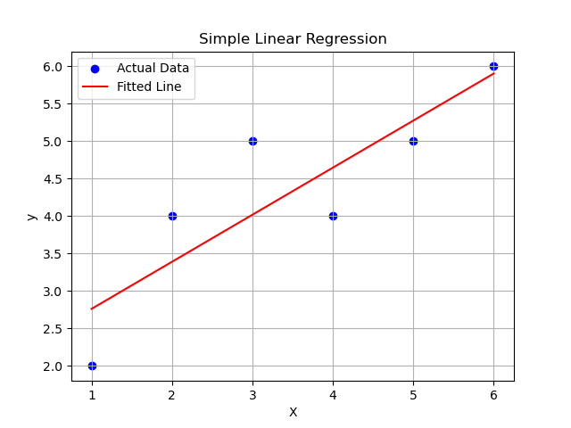

# P6 - Simple Linear Regression with Visualization

## Description
This project demonstrates simple linear regression using scikit-learn, including model training, prediction, and visualization. Linear regression is a fundamental machine learning algorithm used to model the relationship between a dependent variable and independent variables.

## Algorithm

### Linear Regression Process
1. **Data Generation**: Create synthetic dataset with features (X) and target values (y)
   - X: `[1, 2, 3, 4, 5, 6]` (reshaped to 2D array)
   - y: `[2, 4, 5, 4, 5, 6]` (target values)
2. **Model Creation**: Initialize LinearRegression model from scikit-learn
3. **Model Training**: Fit the model using training data
4. **Prediction**: Generate predictions for the input data
5. **Visualization**: Create scatter plot with fitted regression line

### Mathematical Background
**Linear Regression Equation**: `y = mx + c`
- **m** (slope): Rate of change in y per unit change in x
- **c** (intercept): Value of y when x = 0
- **Goal**: Find optimal m and c that minimize prediction errors

**Optimization Method**: Ordinary Least Squares (OLS)
- Minimizes sum of squared residuals: `Σ(y_actual - y_predicted)²`

### Code Flow
```
1. Import required libraries (numpy, matplotlib, sklearn)
2. Generate synthetic input data X and target data y
3. Reshape X to 2D array format (required by sklearn)
4. Create LinearRegression model instance
5. Train model using model.fit(X, y)
6. Generate predictions using model.predict(X)
7. Extract model parameters (slope and intercept)
8. Create visualization:
   - Scatter plot of original data
   - Line plot of fitted regression line
   - Add labels, title, legend, and grid
9. Display the plot
```

## Libraries Used
- **NumPy**: For numerical operations and array handling
- **Matplotlib**: For data visualization and plotting
- **scikit-learn**: For linear regression implementation

## Expected Output

### Model Parameters:
For the given dataset, the model will output:
- **Slope (m)**: Approximately 0.6 (varies slightly due to data)
- **Intercept (c)**: Approximately 1.67

### Visualization:
- Blue scatter points showing actual data
- Red line showing the fitted regression line
- Grid for better readability
- Proper labels and legend

### Output Screenshot


## Model Interpretation
The linear regression finds the best-fit line through the data points:
- **Positive slope**: Indicates positive correlation between X and y
- **R-squared**: Measures how well the line fits the data
- **Residuals**: Differences between actual and predicted values

## Key Concepts Demonstrated
- **Supervised Learning**: Learning from input-output pairs
- **Feature Engineering**: Reshaping data for sklearn compatibility
- **Model Training**: Fitting algorithm to data
- **Prediction**: Using trained model for new predictions
- **Visualization**: Graphical representation of results

## Use Cases
- **Trend Analysis**: Understanding relationships between variables
- **Forecasting**: Predicting future values based on trends
- **Feature Importance**: Understanding impact of input variables
- **Baseline Model**: Simple starting point for complex problems

## Model Assumptions
- **Linearity**: Relationship between X and y is linear
- **Independence**: Observations are independent
- **Homoscedasticity**: Constant variance of residuals
- **Normality**: Residuals are normally distributed

## Files
- `p6.py`: Main Python script for linear regression
- `i6.png`: Generated visualization showing data and fitted line
- `README.md`: This documentation file

## How to Run
```bash
cd p6
python p6.py
```

## Learning Objectives
- Understanding linear regression fundamentals
- Working with scikit-learn machine learning library
- Data visualization for model interpretation
- Model parameter interpretation
- Introduction to supervised learning concepts
- Scientific computing with NumPy and Matplotlib
