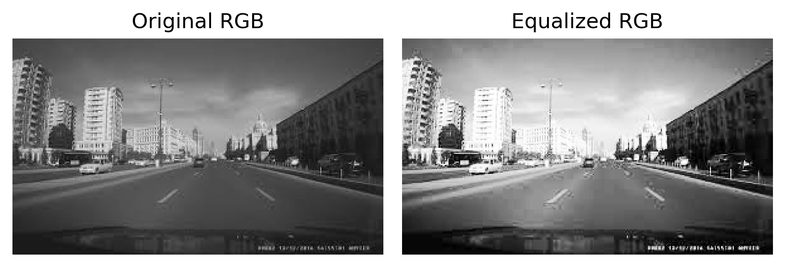

# P7 - Histogram Equalization for Image Enhancement

## Description
This project demonstrates histogram equalization technique for enhancing image contrast using OpenCV and matplotlib. The algorithm improves the visual quality of images by redistributing pixel intensities.

## Algorithm

### Histogram Equalization Process
1. **Image Loading**: Load the input image using OpenCV (`cv2.imread()`)
2. **Color Space Conversion**: Convert from BGR to HSV color space
   - **HSV** = Hue, Saturation, Value (Brightness)
   - This allows us to work with brightness independently from color information
3. **Channel Separation**: Split HSV image into individual H, S, V channels
4. **Histogram Equalization**: Apply equalization only to the V (brightness) channel
   - Use `cv2.equalizeHist()` function
   - This redistributes pixel intensities to utilize the full range (0-255)
5. **Channel Merging**: Combine the original H, S channels with the equalized V channel
6. **Color Space Conversion**: Convert back to RGB for display
7. **Visualization**: Display original and processed images side by side

### Mathematical Background
- **Histogram Equalization**: Transforms the image so that its histogram is approximately uniform
- **Formula**: `s = T(r) = (L-1) * CDF(r)`
  - Where `s` is the output intensity, `r` is input intensity
  - `L` is the number of intensity levels (256 for 8-bit images)
  - `CDF` is the Cumulative Distribution Function

### Code Flow
```
1. Load image in BGR format
2. Convert BGR → HSV
3. Split into H, S, V channels
4. Apply histogram equalization to V channel only
5. Merge channels back: [H, S, V_equalized]
6. Convert HSV → BGR → RGB for display
7. Create side-by-side comparison plot
8. Save and display results
```

## Libraries Used
- **OpenCV (cv2)**: For image processing operations
- **Matplotlib**: For image display and saving results
- **NumPy**: Implicitly used by OpenCV for array operations

## Input/Output
- **Input**: `road.png` - Original road scene image
- **Output**: `histogram_equalization_result.png` - Comparison showing original vs equalized image

### Output Screenshot


## Why HSV Color Space?
- **Preserves Color Information**: By equalizing only the V (brightness) channel, we enhance contrast without affecting the hue and saturation
- **Natural Brightness Enhancement**: HSV separates brightness from color information, making it ideal for contrast enhancement
- **Avoids Color Distortion**: Direct equalization on RGB channels can cause unwanted color shifts

## Expected Results
- Enhanced contrast and visibility
- Better detail visibility in darker regions
- Improved overall image quality
- Preserved color relationships

## Files
- `p7.py`: Main Python script for histogram equalization
- `road.png`: Input image (road scene)
- `histogram_equalization_result.png`: Generated output comparison
- `README.md`: This documentation file

## How to Run
```bash
cd p7
python p7.py
```

## Learning Objectives
- Understanding histogram equalization technique
- Working with different color spaces (BGR, HSV, RGB)
- Image enhancement and preprocessing
- OpenCV image processing operations
- Matplotlib for scientific visualization
